Overview
========

슬라이스 데이터 저장
----
슬라이싱 중에 나오는 레이어의 폴리곤과 같은 중간 결과는 `SliceDataStorage` 클래스와 그 자식 클래스에 저장된다. 이 데이터는 메모리 점유를 줄이기 위해 가능한 단기간만 유지된다. 슬라이싱 중에는 바로 전 단계의 데이터만 사용한다. 자세한 내용은 [`파이프라인`](#pipeline)에 있다.  

고정점 좌표
----
좌표는 원점에서부터의 거리를 micron을 나타내는 64비트 정수로 저장한다. 좌표점에서 1000은 1mm를 나타낸다.

이 좌표계를 선택한 이유는 0에서 멀어지면서 해상도가 바뀜에 따라 생기는 예상못한 라운딩 에러를 줄이기 위해서 정수를 사용한다. 또한 CuraEngine이 사용하는 라이브러리는 다각형 최적화 작업을 64비트 정수에서 작동한다. 마이크론을 사용하면 해상도가 충분히 높고 계산식에서 크기 제한이 없다.

정수가 오버플로우되지 않도록 주의가 필요하다. 특히 유클리드 거리와 면적에 관련된 계산은 제곱이 필요하므로 주의가 필요하다.

Parts
-----

Cura는 여러 윤곽선들을 가지는 복잡한 다각형을 처리한다. 이 윤곽선들 중에 다른 윤곽선이 차지하고 있는 영역과 중첩된다, *part*는 다른 윤곽선들과 중첩되지 않은 윤곽선들이다.

예를 들어 큐브를 슬라이싱하면 각 레이어마다 사각형 절단면이 하나 나올 것이다. 하지만 테이블을 슬라이싱하면 어떤 레이어는 테이블의 다리마다 하나씩 총 4개의 윤곽선을 만들 것이다. 그러면 그 레이어에는 4개의 *part*가 생긴다.

CuraEngine의 대부분의 연산은 파트 상에서 실행된다. 애플리케이션은 어떤 벽도 넘어갈 필요가 없이 그 파트 안에서 트레블 이동이 안전하게 이루어질 수 있음을 알 수 있다. 이것은 모델의 바깥 부분으로의 트레블을 최소화한다.

이들 다각형들이 중첩되면 각 파트는 여전히 여러개의 윤곽선을 가질 수 있다. 파트는 내부가 텅빌 수 도 있다.


파이프라인<a id="pipeline"></a>
====

이 절은 처음부터 끝까지 슬라이싱 프로세스를 간단하게 소개한다.

물체를 슬라이싱하는데 5개의 메인 스테이지가 있다. 모든 것이 순차적으로 실행되는 것은 아니다. 메모리 오버헤드를 줄이고 멀티쓰레드 성능을 높이기 위해 CuraEngine은 생산자-소비자 패턴에서 몇가지 단계를 실행한다. 한 쓰레드는 앞쪽 스테이지에서 데이터를 만들고 동시에 또 다른 쓰레드는 뒤쪽 스테이지를 계산하면서 데이터를 사용한다. 

[`Slicing`](#slicing)
----

파이프라인에서 첫번째 단계는 슬라이싱 스테이지이다. 3D mesh를 2D 레이어로 변환한다. 먼저 절단면을 만드는 곳에 높이를 결정한다. 다음에는 그 높이에 있는 모든 삼각형의 절단면을 만든다. 이것은 일반적으로는 선분이다. 이 선분들을 엮어서 가능하면 다각형으로 만든다.

[`영역 생성`](#generating_areas)
----

레이어들을 대상으로 이 단계에서는 프린트하려고 하는 물건의 타입들로 채울 영역으로 레이어들을 나눈다. 어떤 부분이 벽이 될까? 어떤 부분이 채워질까? 지지대는 어디에 둘까?

[`경로 생성`](#generating_paths)
----
이 단계는 가장 복잡한 부분이다. 앞 스테이지에서 생성한 영역들이 실제로 선분들로 채워질 것이다. 선분을 프린트하는 순서가 여기에서 결정된다. 이 단계의 출력은 프린터가 실행하는 이동 명령들과 실행되는 순서가 들어있는 `LayerPlan` 집합이다. 

[`Inserts`](#inserts)
----

플랜을 만든 후에도 약간을 플랜을 수정할 수 있다. 압출기를 교체하기 전에 노즐의 사전 예열과 사전 쿨링하는 명령을 삽입해야 한다. 노즐을 얼만큼 앞으로 보낼지를 예측하려면 노즐의 가열과 냉각을 얼마나 빨리 시작해야 하는지를 예측하기 위해 각 경로마다 시간 추정을 생성하며 다가오는 움직임으로 커버될 가열과 냉각에 필요한 시간과 같은 온도 변화 명령을 넣는다.

[`G-code`](#gcode_export)
----
마지막으로 우리가 생성한 플랜들은 온도 삽입을 포함해서 CuraEngine의 내부 표현이 g-code로 변환된다.


Settings<a id="settings"></a>
=========

설정들은 scene 객체의 `Settings` 인스턴스에 저장된다. 여기에서는 설정을 가져오는 방법과 scene을 구성하는 방법을 설명한다.

Settings 가져오기
----------

설정은 scene의 모든 객체에 저장돤다. scene 자체, mesh 그룹, 압출기 트레인과 mesh 등 모든 객체에 저장되어 있다. `Settings` 클래스의 인스턴스에 저장된다.

`Settings` 클래스는 키와 `Settings` 인스턴스를 가진 매핑이다. 이 인스턴스 각각은 모든 설정 프로퍼티가 들어 있다. 현재 이것은 문자열로 저장된 설정 값, 익스트루더를 가리키는 포인터로 저장된 특정 익스트루더의 제약 사항을 포함한다. 설정 값은 여기에 문자열로 저장되며 나중에 다양한 방식으로 해석될 수 있다. 예를 들어 각도를 나타내는 설정은 어디에서는 `degree`로 어디에서는 `radian`으로 해석될 수 있다. 설정 값을 요청할 때는 어떤 타입이 리턴되어야 할지를 템플릿으로 지정한다.

```c++
    const Settings& settings = Application::getInstance().current_slice->scene.settings;
    AngleDegrees angle_in_degrees = settings.get<AngleDegrees>("support_angle"); //Between 0 and 360.
    AngleRadians angle_in_radians = settings.get<AngleRadians>("support_angle"); //Between 0 and tau.
```

하지만 특정 타입의 설정은 특별하게 다루어야 한다:

* 압출기의 수는 글로벌 `machine_extruder_count` 설정과 같아야 하지만 scene의 압출기 수는 leading으로 보인다. 설정 값 대신 `Application::getInstance().current_slice->scene.extruders.size()` 을 사용한다.
* 마찬가지로 인스트루더의 갯수 설정(`support_infill_extruder_nr`와 같은)은  `ExtruderTrain&`  중첩을 사용하여 얻어온 다음 결과 트레인으로부터 압출기 갯수를 구한다.

Inheritance
----

각 `Settings` 인스턴스는 scene에 있는 하나를 제외하고 부모가 있다. 설정이 현재의 Settings 인스턴스에 있지 않다면 설정을 부모에게 요청한다. `Scene` 인스턴스에 모든 설정이 들어 있다. scene 객체들의 계층도는 `Settings` 인스턴스에서 부모-자식 관계를 반영한다.

* scene은 글로벌 설정인 트리의 루트임.
* scene의 mesh 그룹의 부모. per-mesh-group 설정이다. 
* 압출기의 부모는 현재의 mesh 그룹이다. 다음번 mesh 그룹을 처리할 때, 압출기 train의 부모는 다음번 mesh 그룹으로 바뀐다. 이들 압출기들은 per-extruder 설정을 가진다.
* mesh의 부모는 mesh를 프린트하는 압출기들이다. mesh들은 per-mesh 설정을 가진다.

설정이 있는지의 여부는 프론트엔드 또는 명령행으로 보냈는지에 달려 있다.

Limiting to extruder
-------

프린터 특성이 특정 압출기로 프린트하도록 설정된다면 어떤 설정을 위한 익스트루더가 제한될 것이다. 예를 들어 infill은 두번째 압출기로 프린트하도록 설정된다면 모든 infill 설정은 두번째 압출기로 계산되어야 한다. 만일 그 압출기의 설정이 있다면 먼저 그 압출기의 제약을 계산한다. 그 다음에는 압출기의 제약은 다시는 계산하지 않는다. 설정을 구하는 최종 알고리즘은 다음과 같다.

1. 현재 `Settings` 인스턴스에 설정이 있다면 그것을 리턴한다. 아니면 ...
2. 설정이 특정 압출기에 제한된다면 그 압출기로부터 얻어온다. 그 다음부터는 더 이상 그 압출기에 제약되지 않는다. 아니면 ...
3. 현재 `Settings` 인스턴스가 부모가 있으면 거기서 설정을 가져온다. 아니면 ... 
4. 에러를 일으킨다. 설정은 더 이상 존재하지 않는다!

Scene<a id="scene"></a>
=====

프린트할 scene에 객체들이 구성된 계층 구조를 설명한다. 이 구조는 아래의 다이아그램과 같다.


The Hierarchy
-------------

단편들은 큐에 쌓아 처리할 수 있다. 각 단편은 프린트가 예정된 객체로 채워져 있는 빌드 플레이트를 나타내는 자신의 scene이 들어 있다.

각 scence은 여러개의 mesh 그룹과 여러개의 압출기가 들어 있다. 이 mesh 그룹들은 한번에 하나씩 처리된다. 각 mesh 그룹마다 같은 압출기가 사용된다. mesh 그룹에는  여러 mesh가 들어 있다.

이 scene은 커뮤니케이션 클래스가 구축한다.

Slicing<a id="slicing"></a>
==========================

여기서는 CuraEngine이 3D mesh의 단편을 만드는 방법을 설명한다.

"슬라이싱"이란 용어는 혼동되는 용어이다. Cura는 "슬라이서"라고 하지만 슬라이서는 3D mesh를 g-code로 변환하는 과정을 "슬라이싱"이라고 부르기 때문이다. 여기서는 "슬라이싱"을 3D mesh의 절단면을 특정한 높이로 만드는 과정이라고 정의한다.

레이어 높이 결정하기
---------------------

CuraEngine은 3D mesh의 절단면을 만들기 전에 먼저 절단면의 높이를 결정해야 한다.

각 레이어는 Z축으로 특정한 스팬을 가진다. 예를 들어 첫번 레이어는 0에서 0.27mm까지의 스팬을, 2번째 레이어는 0.27mm에서 0.37mm까지, 3번째 레이어는 0.37mm에서 0.47mm의 스팬을 가진다. 각 레이어의 절단면은 기본적으로 각 레이어의 스팬의 중앙을 지날 것이다. 여기의 첫 레이어에서는 0.135mm 높이로 슬라이스 한다. 레이어는 레이어의 상단 높이에서 프린트할 것이므로 레이어를 프린트하기 전에 `Z0.27`로 이동하는 명령을 둘 것이다. 

일반적으로 첫 레이어는 `Initial Layer Height`라는 별도의 레이어 높이가 있다. 나머지 레이어들은 `Layer Height` 설정을 사용한다.

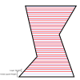

다른 방법으로 `Adaptive Layer Height`로는 절단면의 Z 좌표가 모델의 모양에 근거하여 결정된다. Slicing Tolerance를 Inclusive 또는 Exclusive로 설정하면 중간이 아니라 레이어의 경계 부분을 슬라이스할 것이다.

삼각형들을 선분들로
--------

절단면의 높이가 결정되면 모든 삼각형들은 모든 레이어 높이마다의 평면으로 교차되어 그들이 교차한 곳의 선분들을 만들어낸다. 

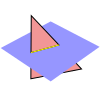

성능상의 이유로 먼저 mesh에 있는 모든 삼각형들을 순회한다. 각 삼각형들에 대해 이 삼각형이 교차하는 레이어를 반복하고 이러한 레이어에 대해 교차점에서 선분을 만든다. 루프의 순서는 직관적이지 않지만 효율적이다. 세 꼭짓점의 Z 좌표를 보면 삼각형이 교차하는 삼각형을 쉽게 결정할 수 있으므로 모든 삼각형에 대해 모든 레이어를 검사 할 필요는 없고 교차점을 생성하는 삼각형 만 검사 할 필요는 없다.

한 평면과 한 삼각형의 교차를 찾기 위해 삼각형의 세 변 성분을 모두 보간 한다. 이들 중 적어도 두 개는 평면에 놓여야 한다. 보간들이 평면에서 동일한 Z 좌표를 가진 곳에 두 좌표가 두 선분의 종단점이 될 것이다.

Stitching
----

모든 삼각형이 선분으로 변환되었을 때 레이어마다 느슨한 선분들 뭉치가 생긴다. 이 선분들은 아직 다각형으로 연결되어 있지 않다.

이들을 연결하기 위해 CuraEngine은 서로 가까운 종단점을 가진 선분들을 찾는다. 선분들은 방향이 있으며 좋은 다각형을 만들려면 방향이 일관되어야 한다. 

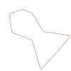

Nonmanifold Meshes
----

모든 mesh들이 완벽한 것은 아니다. Cura가 슬라이스하는 많은 mesh들은 빈틈이 있거나 중간에 추가적인 형상이 있다. 그러한 mesh들을 위해 슬라이싱 스테이지에서 적용하는 중요한 두가지 루틴이 있다.  

mesh의 표면이 자신을 교차하면 종종 하나의 좌표에 두 개 이상의 선분이 인접한 경우가 있다. 이 경우 CuraEngine은 서로 가장 평행한 표면을 서로 연결하려고 시도한다. 이것은 일반적으로 벽이 급격하게 꺽이는 곳에 교차면이 있는 것이 아니라 연속적인 mesh를 보고자 할때 의미가 있다.

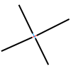
 
연쇄적인 선분들이 닫힌 루프를 형성하도록 연결될 수 없다면 이 연쇄는 열린 다각형으로 저장된다. 열린 다각형들은 CuraEngine의 정상적인 슬리이싱 프로세스에 사용되지 않지만 Surface Mode가 `Surface` 또는 `Both`인 경우를 위해 저장된다. 그 경우에는 패스 생성 스테이지 동안 벽 경로로 변환된다. 아래의 예제는 아무것에되 연결되지 않는 선분이 중간에 있다. 이것은 대부분의 슬라이싱 프로세스 동안 다각형 부분이 되지 않는다.

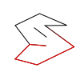

이 에제는 한 쪽 끝 자체로 끝나고 다른 쪽 끝도 느슨하게 연결된 일련의 선분이 있다. 이것은 열린 다각형으로 간주된다. 또한 T- 크로싱은 서로 가장 평행 한 두 선을 연결한다. 세 번째 엔드 포인트는 개방형입니다.


경로 생성하기<a id="generating_paths"></a>
==============

슬라이싱 스테이지 중 하나가 영역을 채우는 것인데 이전에는 실제 물체를 만드는 선과 함께 특정한 특성 타입으로 지정되었다. 이 스테이지가 가장 복잡하다. CuraEngine이 대부분의 트릭을 사용하는 곳이다. 악마는 디테일에 있다. 이 절은 주요 기법을 강조한다.

프린팅 순서
-------------------------

경로는 프린트 순서와 동일하게 생성된다. 이것은 메모리를 절약하고 아키텍처도 단순하게 만든다. 따라서 경로를 생성하기 전에 순서를 결정해야 한다. 프린트 순서는 상당히 엄격한다.

좀 더 중요한 것들을 함께 묶기 위한 우선 순위가 존재한다. 우선 순위는 다음과 같다.

1. Each mesh group is printed in the sequence that they are sent to CuraEngine. A mesh group is a group of meshes that will get printed from bottom to top. Normally, your entire scene will consist of one mesh group, but if slicing via the command line or if the "One at a Time" mode is enabled in the front-end, you could have multiple mesh groups. The optimal sequence is determined by the front-end in order to minimise the collision area of each mesh group due to the shape of the print head when the nozzle needs to move back down towards the build plate for each mesh group.
2. 레이어는 바닥에서 위쪽 순서로 프린트 된다.
3. Every extruder plan is printed in a certain order. The optimal order in which to print the extruders is determined beforehand in order to minimise the number of extruder switches. For example, if the printer has two extruders, then the first layer might start with the first extruder, then switch to the second extruder. The next layer must then start with the second extruder (so that there is no switch upon the layer transition) and switch to the first extruder. There will then be at most one extruder switch per layer.
4. Every mesh is printed separately. The order is determined in order to minimise travel moves and switches in configuration.
5. Every part of a mesh is printed separately. The order is determined in order to minimise travel moves again. The "parts" of a mesh are the disparate zones that originally came from the same 3D model file, but are in this layer separated by air.

한 레이어 상의 압출기 계획안에는 어떤 특징을 프린트할지 엄격한 순서가 있다. 순서는 다음과 같다.

- Prime blob, if this is the first layer and a prime blob is requested.
- Prime tower, if the prime tower is enabled and there are any extruder switches in this layer or any higher layer.
- The skirt, brim or raft, whichever one is activated, if any, and if the bed adhesion is printing with this extruder.
- Ooze shield, if enabled and this is the first extruder on the layer.
- Draft shield, if enabled and this is the first extruder on the layer.
- Support, if enabled and set to print with this extruder.
- Each part is printed in order.
  - Infill.
  - Inner Walls.
  - Outer Wall.
  - Gaps in the walls are filled.
  - Skin.
  - Gaps in the skin are filled.
  - Ironing, if enabled.
  - Surface Mode, if set to "All" or "Surface".

Within a part there is a slight flexibility in the order due to the "Infill Before Walls" setting and the "Outer Before Inner Walls" setting.

Wall 생성하기
----------------------
During the stage where the areas are generated for each feature type, one inset was already generated for every wall. These insets are going to become the centreline for each wall. Their vertex coordinates are eventually going to end up in the g-code as the destination coordinates of moves. Some work needs to be done to plan them properly though.

Each wall is given a certain line width, depending on the line width settings. The line segments for these walls are stored in an "Extruder Plan", an internal data structure. However the area that will get covered by these walls must also be calculated. In particular, the area that is _not_ covered by the walls must be calculated, because these are gaps that fall between the walls and must be filled with material later. In the image below, these gaps are indicated with a black outline.

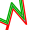

Typically such gaps occur in very sharp corners. The nozzle is too fat to fit all the way into the corner without overextruding, so a gap will fall in the thinner part of the corner. Gaps can also occur in thin pieces where two walls are too close to each other to fill with another wall.

When generating a wall, CuraEngine also checks for overlap with previously printed walls. This includes the wall right before it, where there could be considerable overlap. The part of the new wall that overlaps with the previous wall will get its line width reduced such that the new area of that part of the line is only the part that is not covered by the other line.

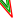

Instead of actually reducing the flow rate of this thinner line segment, the speed of movement is increased. Typically a printer will have more short-term control over its velocity than its flow rate.

Infill 패턴
----
Infill patterns are used not only for generating infill, but also for generating support, skin and even ironing. They are CuraEngine's go-to method to fill an area with material. Here the task is to draw lines inside a certain shape to fill that shape with the desired material density.

The most basic infill pattern is lines infill. Most infill patterns are based on lines. Triangular infill, for instance, is just lines infill but repeated three times at 60 degree angles from each other. Even octet infill is based on lines, repeated twice vertically and twice horizontally, and then shifted with a certain offset as to create tetrahedra and octets.

For lines infill, the shape to fill is crossed with several scan lines at a certain distance from each other. This distance is computed such that the line width of this feature causes the desired infill density (e.g. 1 line width distance for 100% density, twice the line width for 50% density, and so on). Where the scan lines intersect the shape, the intersection point is computed and between every two scan lines, a line is generated. This is line infill.

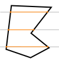

Infill lines are optionally connected together. The algorithm to connect infill lines starts connecting two arbitrary adjacent lines. Then it follows the perimeter until it encounters the next crossing and connects that to the crossing after it, and so on until it's passed around the entire perimeter. It skips only the adjacent crossings if they are already part of the same polyline, so that no loops are created. This usually creates one single infill polyline, but this is not guaranteed; there are exceptional shapes that cannot be completely connected in this way.

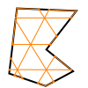


Filling Small Gaps
------------------------
Sometimes there is a gap between two walls or a bit of skin that is just too small to fill with a full-fledged wall or skin line. These gaps are filled with a special technique that aims to be able to fill any arbitrarily shaped gap with material. The areas that need to be filled with gaps are generated when the lines for walls and for skin are generated, by subtracting the area that gets covered by walls and skin lines from the area that was originally designated for walls and skin respectively.

The first step in this process is to fill a shape with very thin lines. These thin lines are planned normally. The image below shows a theoretical gap that fell between two walls that approached each other in a curve, and at this point was too thin to fit another wall between them.


This wouldn't print well. For one, these lines are barely thick enough to extrude any material at all. The accelerations that the printer would be subjected to by these lines would also kill any resemblance of print quality. Therefore these lines are connected to each other in a smoother curve. If the endpoints of two adjacent lines are close enough together, they will get merged together. When this happens, a line will get drawn from the middle of the first line segment to the middle of the second line segment. The result would be something like the image below.


The line widths of these lines are then adjusted in order to cover the same area as the original skin lines that they replaced. Just like when the line widths of walls were adjusted to compensate for overlapping walls, CuraEngine adjusts the print speed here too instead of actually extruding less or more while printing these lines. The printer typically has greater control over movement speed than over the flow of material exiting the nozzle. The result of adjusting these line widths looks a bit like the image below.

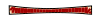

The area covered by this adjusted line approximates the total area of the gap, since it equals the area covered by the original thin lines.

Optimal Line Order
----
When a bunch of lines are printed together, the optimal order in which to print these lines is approximated. This is not used for all lines together, but only for a group of lines of the same feature and the same part, such as the skin lines within one part. Finding the perfect order is a special case of the [Travelling Salesman Problem](https://en.wikipedia.org/wiki/Travelling_salesman_problem) which is an NP-hard problem for which only exponential-time algorithms exist, which is infeasible to compute for CuraEngine within a desirable time span. The Nearest Neighbour approximation heuristic is made, which is only quadratic.

For this approximation, after printing a line, CuraEngine looks for the nearest endpoint of a line that has not yet been printed. It travels there and prints that line. Then the nearest unprinted line is chosen again, and so on until all lines have been printed.

One slight adjustment needs to be made though because the nozzle cannot accelerate perfectly. Travel moves that move in a line parallel to the line that has just been printed are preferred. There is a weighting scheme to make this consideration based on the sine of the angle between the printed line and the line towards the destination. This reduces overal printing time due to acceleration limitations.

트래블링
----

A에서 B로 이동시 CuraEngine은 뜨겁고 플라스틱이 덮힌 노즐이 깨지기 쉬운 프린트 펴면을 망치지 않도록 조심할 필요가 있다. 이것을 최소화하기 위한 몇가지 기법을 사용한다.

노즐이 벽에 위치하는 동안 리트랙션이 요청된다면 먼저 mesh 안으로 조금 들어갈 필요가 있다. 리트랙션은 노즐을 잠깐 정지하게 한다. 그 동안에 재료가 튀어나오고 앞서 프린트된 재료가 녹는다. 모델 안에서는 보이지 않으므로 사소한 이슈이다. 노즐이 내부로 들어갈 것이고 거기서 리트랙트한 다음에는 그의 목적 파트의 채움으로 이동한다. 마찬가지로 이것이 프린트 외부에 너무 가깝지 않으면 목적 파트에서는 직접 목적 지점으로 가지 않을 수 있다. 먼저 mesh 내부로 트래블해야 하며 벽에서 떨어지고 거기서 철회한 다음 최종 지점으로 이동한다.

한 파트에서 다른 파트로 트래블하면 어떤 재료는 리트랙션을 해도 샐 것이다. 그래서 Curaegine은 먼저 시작한 지점이 아니라 두 파트가 가장 가까운 지점을 찾고 교차하는 이유이다. 이 기법을 `combing`이라고 한다. 이것은 프린트물의 외부에 흘림으로 나타내는 재료의 양을 최소화한다. 전체 트레블 시간은 더 길지만 모델 외부로의 이동 시간은 더 짧다. 아래의 그림은 그런 트레블이 어떻게 보이는지를 보여준다.

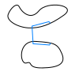

With any travel move CuraEngine needs to be careful not to cross any outside walls unnecessarily. It could avoid hitting these walls with a Z-hop, but the Z axis is typically slow and susceptible to wear. It could also move around these walls horizontally with collision avoidance. Making a choice between when to retract, perform combing and perform a Z hop is a complex affair that roughly follows the following flow chart:

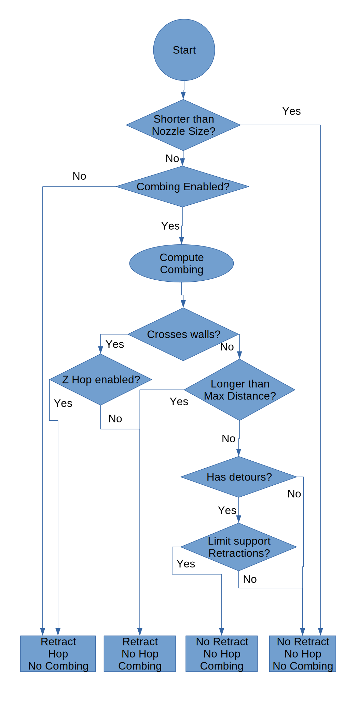

Collision avoidance is performed by offsetting everything that the nozzle might hit with a certain safe distance, and then seeing if the travel move intersects this offset. If it does, the intersection points are determined and the decision must be made as to which direction to go in order to avoid this object. The decision of which direction to go is heuristically determined based on the amount of vertices along the perimeter of the shape that needs to be avoided. The side with the fewest vertices is assumed to be the shortest detour, so the travel move is adjusted to follow the perimeter of the offset along that side. If any vertices can be skipped without hitting another perimeter, these vertices are left out. The result looks like the image below.

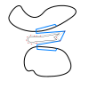

This same technique for collision avoidance is employed when travelling within a single piece. An inset of this piece is then performed and the perimeter of that is avoided. If the travel move can be made within one piece, a retraction may not be necessary.


영역 생성하기<a id="generating_areas"></a>
============

CuraEngine이 모델의 절단면들을 만든 후에는 각 레이어를 특정 목적으로 제공하는 재료로 채워질 영역으로 분할할 것이다. 그중에 가장 중요한 "특징"이 infill, walls, support이다. 이 슬라이싱 단계에서는 입력이 레이어이고 출력은 각 레이어에 대한 다각형들이다. 이 다각형들은 infill로 채울지, skin일지 등등의 특징으로 그룹화한다.

Separating Out the Walls
---------------------------------
레이어를 영역으로 분리하는 첫 단계는 벽이 되려고 하는 부분을 분리해 내는 것이다.

이를 위해 각각의 벽에 하나씩, 원래의 레이어 모양으로부터 다수의 삽입물이 생성된다. 아래 이미지에서는 3개의 벽이 생성된다. 하나는 외벽(빨간색)을 위한 것이고 다른 하나는 내벽(녹색)을 위한 것입니다

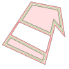

The first inset (drawn in red) is generated for the outer wall. It's offset with 1/2 the line width of the outer wall. The result is a contour that goes through the middle of the outer wall. The corners of this contour will eventually end up in the g-code as the destination coordinates that the nozzle must move towards.

The second inset (in green) is generated for the first inner wall. It is an inset from the shape outlined by the first inset. This inset's distance is equal to half of the outer wall line width plus half of the inner wall line width. The half of the outer wall line width is to end up on the inside edge of the outer wall line, and then another half of the inner wall line width is added to end up again in the centre line of this first inner wall.

The third inset and any further insets are generated for the second inner wall and beyond. This is an inset of one inner wall line width away from the previous inset. The shape is then again the centre line of the next inner wall.

Lastly, one additional inset is produced from the innermost wall, by half of the inner wall line width (drawn in black). This inset marks the inside edge of the walls. That shape then has to be filled with either skin or infill.

Infill에서 Skin을 분리하기
----------------------------

그 다음에 CuraEngine은 이 중간 삽입물에 스킨 및 충전재를 채워야한다. Skin을 어디에 둘지와 채우는 장소를 결정해야 한다. 

예를 들면 바닥 스킨을 채울 필요가 있는 영역을 찾는 기본 기법은 스킨의 두께에 따라 아래의 여러 레이어들을 살피는 것이다. 하위의 레이어에 공간이 있을 때마다 현재 레이어에 스킨이 있어야 한다.

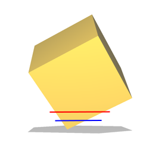 

위의 이미지에는 스킨과 충전재로 나뉜 레이어를 빨강색으로 보여준다. 이 부분에서 skin이 될 부분과 채워질 부분을 결정하기 위해 파란색 레이어를 보고 있다. 빨강 영역 내부이지만 파란색 영역이 아닌 부분이 skin이 된다. 빨강이면서 파랑 영역인 부분은 infill이 된다.

실제로는 더 복잡하다. CuraEngine은 현재 레이어보다 하나의 스킨 두께인 레이어 뿐만 아니라 그 사이의 모든 레이어도 봐야한다. 그렇지 않으면 스킨 두께보다 작은 층의 간격이 포착되지 않기 때문이다.

상단 스킨의 경우는 아래 레이어가 아니라 현재 레이어 위의 레이어를 찾아야 한다.


지지물
------------
Generating support is a fairly complex algorithm, but the gist of the idea is outlaid here.

The first step in generating support is determining where there is overhang in your print. The surfaces of the 3D mesh are not retained in memory at this point any more, so we can't just look at the triangles that have a certain angle w.r.t. the Z axis; we must look only at 2D layers.

A normal, filled layer is assumed to support the layer that's above it. It will also support the layer above it fine even if the layer above it extends slightly beyond the layer below. The limit to how far the layer above can extend to still be supported by the layer below is what we'll call the "support distance". If we assume that the layer below supports the layer above if the slope between the edges of these layers is less than a certain angle (the Overhang Angle setting), then we can compute the support distance with a simple formula: `tan(a) * layer_height`

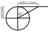

CuraEngine will perform an offset of the current layer (drawn below in black) by this support distance (drawn in gray), and then subtract that from the layer above to get the area that is called the "basic support" (drawn in blue).

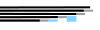

This type of support wouldn't print well however. It is all broken up into pieces. Typically this generates long, thin strands of areas (about 0.2mm wide) that need to be supported but gaps in between because technically that part in between is supported by the previous layer.

To get a more continuous support area, the basic support areas are merged. This merge is done by performing an offset of the support area by the support distance. Since the basic support areas tend to have the support distance between them, this causes adjacent support areas to overlap and merge together.

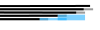

This does extend the support beyond the original part that needs to be supported, so it then subtracts everything from the support that is not in the layer above. This is called the "extended support" and forms the basis for the area that will eventually be filled with the support pattern. It needs some slight modifications though.

Support X/Y and Z Distance
----
The extended support would produce support that looks a bit like this:


This looks nice but is undesirable since the support is directly adjacent to the mesh. It would stick far too well to the mesh. For that reason, some distance is created between the support and the model. Cura has several settings concerning the distance in the Z direction and in the X and Y directions.

The Z distance is maintained by not looking directly at the part that needs to be supported in the layer above the current layer, but by looking several layers higher, of which the total thickness equals the Z distance. This would then create a print like this:


If the slope is very steep or there is a bit of overhang next to a vertical wall, this would still cause problems since the support is still very close to the sides of the print. This can be seen in the image above at the bottom side of the print. For this reason, CuraEngine also maintains a horizontal distance, the Support X/Y Distance setting.

This introduces two constraints in the distance that support must keep to the model however: It must maintain a certain Z distance and a certain X/Y distance. Neither of these may be too small or too large. This is overconstrained, so one of them must supersede the other. This is determined by the Support Distance Priority setting, which can be set to prioritise either the Z distance or the X/Y distance. By default, the Z distance is prioritised. This causes our print to look a bit like this:


As you can see, the X/Y distance is only applied if the Z distance is not applicable: In the small area at the bottom where the slope was completely vertical. This does catch many cases with mechanical parts though where a vertical wall is next to a piece of overhang.

In many cases with more organic shapes this is still not desirable however, since the support will still stick to a slope that is _almost_ vertical. For these cases there is another setting, Minimum Support X/Y Distance, which overrides the Z distance again. The print will then look like this:


In the picture above there is a slight kink in the curve along the topside of the support if you look closely. Above the kink the Z distance is leading. Below the kink the Minimum Support X/Y Distance is leading.

Stair-Stepping
----
In order to be able to easily remove support from sloped surfaces, stair-stepping was added.

If support has to be generated above a sloped surface, stair-stepping is invoked with the Support Stair Step Height and the Support Stair Step Maximum Width a step can have as parameters. The idea is to start at a layer, and for the next few layers above it (determined by the step-height and layer-height) 'lock' the layers in to place in the specific area of the slope. After that (when the step-height is reached), 'release' the next layer and take that as the next base.

In practice, this will create an inverted staircase, where the tips of the steps are closest to the model and likely the only contact-points.


This picture shows clearly what stair-stepping is meant to do. For clarity, all support-offset distances have been set to 0.

There are some subtleties to the stair-stepping algorithm however, when it comes to the X/Y-distance offset and Z-distance offset: Namely, _if_ support is higher above the sloped area because of X/Y-distance, then the additional height above the model _isn't_ taken into account when the 'steps' are produced. 


As you can see in the picture above, in this case (Z-distance set to 0, X/Y distance increased, but lower than the step-height) it's as if the stair-stepping was done _first_, and only afterwards the X/Y distance was subtracted (that's not _quite_ how it works internally, but the effect here is the same).

However, _if_ support is higher above the sloped area because of the Z-distance, then the additional height above the model _is_ taken into account when the steps are created.


In the picture above you can see that effect in that case (Z-distance increased, X/Y-distance set to 0). Notice how the support is raised above the model, but the height of the stair-steps aren't influenced.

Of course, in practice, X/Y- and Z- distance offsets are both often greater than none. In that case it depends on the slope of the model, whether X/Y overrides Z or the other way around, and on the particular distances involved.


Inserts<a id="inserts"></a>

=============================

모든 경로를 생성한 후에 이들 경로에 대해 추가 패스가 하나 만들어진다. 이 패스는 프린팅 플랜에 뭔가를 삽입한다. 현재는 예열과 예냉각 명령 뿐이다.

예열과 예냉각
----

여러개의 압출기로 프린트할 때 프린터는 다른 노즐이 프린트하는 동안 대기중인 노즐은 냉각을 시켜야 한다. 그래야 열 때문에 재료가 눌어붙어 막히는 것을 막을 수 있다. 노즐은 대기 온도로 냉각된다. 노즐을 다시 사용할 수 있기 전에 프린팅 온도로 가열되어야 한다. 이것이 예열 과정에 관한 것이다.

또한 압출기를 전환하기 바로 전에 활성 압출기는 약간 냉각된다. 이것은 압출기를 전환하는 동안 노즐이 약간 낮은 온도가 돠도록 하여 전환 동안 새는 양을 줄인다. 두개의 노즐에 대한 CuraEngine의 온도 조절 방식을 야래의 그림에서 보여준다.


There is a machine setting that tells Cura how fast a nozzle can heat up, approximately, in degrees Celsius per second. This is of course a rough approximation since the heating speed varies strongly with the delta between the nozzle temperature and the environment temperature. But it works well enough to estimate the amount of time required to bring the nozzle from stand-by temperature to printing temperature. This pre-heating time is how far before the first extrusion of that nozzle the printer must start heating up.

명령 삽입하기
---------------------

노즐이 얼마나 빨리 가열을 시작해야하는지 알면 엔진은 해당 명령을 실행하는 데 걸리는 시간을 계획에서 각 명령에 대해 계산해야 한다. 이렇게하면 계획에서 가열 명령을 배치해야하는 위치를 알 수 있다.

The time estimates are calculated precisely here, taking everything into account that CuraEngine knows about: velocities, accelerations, jerk, retractions, waiting for minimum layer time, everything. It is not strictly necessary to compute this for every line in the plan. However the total time estimate must be made for the whole print anyway and put in the g-code header, so it is efficient to compute that at the same time.

Once it is known for every line how long it takes to print, CuraEngine will simply add up the printing times for these lines until they exceed the pre-heating time. Then the same is done for the pre-cooling commands.


Exporting to G-code<a name="gcode_export"></a>
========================

슬라이싱 프로세스 마지막에 CuraEngine은 원하는 제품을 생산하기 위해 프린터가 수행해야 하는 모든 작업에 대한 완벽한 계획을 수립할 것이다. 이 계획은 CuraEngine의 내부 구조로 표현되며 g-code로 번역되어야 한다. 변환은 별도의 쓰레드로 planning 스테이지에서 병렬로 진행한다.

변환
----

CuraEngine의 내부 구조와 g-code는 1:1 매핑이므로 변환이 매우 단순한다.

* 경로는 `G1`에 목적지 좌표를 붙여 변환한다.
* 트레블은 `G0`에 목적 좌표만 붙여 변환한다.
* 가열 명령은 프린터가 대기할 필요가 있는지에 따라  `M104` or `M109` 명령으로 변환된다.
* 베드 온도는 프린터가 대기할 필요가 있는지에 따라 `M140` or `M190` 명령으로 바꾼다. 

이외에도 CuraEngine은 수십개의 명령을 구현한다. CuraEngine은 g-code만 구현하지만 X3G와 같은 다른 포맷을 지원하려면 Cura의 프론트엔트가 g-code를 최종 포맷으로 변환하도록 조정할 것이다.

Changing State
---------

경로는 내부 표현에 몇 가지 속성이 있다. 각 경로에는 선 너비, 속도, 팬 속도, 가속, 저크, 레이어 두께 및 흐름이 있다. 이러한 속성(선 너비 및 레이어 두께 제외)이 변경되면 명령을 변경하거나 다른 명령보다 우선해야 한다.

* 속도가 변경되면 `F` 파라미터를 포함하여 정확한 속도롤 설정해야 한다.
* 가속이 변경되면 명령 앞에 `M204` 명령이 나와야 한다.
* If the jerk changes, the command must be preceded by an `M207` command to set the correct jerk.
* If the fan speed changes, the command must be preceded by an `M106` command to dial the fan speed.
* 이 경로(트레블)에 대해 필라멘트가 압입되어야 하는 경우 별도의 수축 명령을 선행해야 한다. 어떤 g-code의 경우 `G10` 명령을 사용하여 수행한다. 다른 경우에는`E` 매개 변수를 이전보다 낮은 것으로 설정하는`G1` 명령으로 수행된다.

The E parameter
----------

각 압출 `G1` 명령은 `E` 파라미터가 있다. 이 파라미터는 이동 마킹하는 동안 재료를 얼마나 내보낼지를 나타낸다..

노즐이 내뿜는 재료의 양은 선과 길이, 너비 및 깊이가 같은 상자의 부피와 같다. 선의 길이에 선의 너비를 곱한 선의 길이는 선의 부피이다. 이를 원하는 재료 흐름 비율에 곱하고 이전 명령의`E` 파라미터에 추가하여 이 명령의`E` 파라미터를 얻는다. 어떤 g-code flavor에서는 이 부피는 또한 필라멘트 공급기 모터가 커버해야 하는 거리를 얻기 위해 필라멘트의 단면적에 의해 나누어져야 한다.

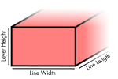

어떤 펌웨어는 긴 인쇄에서 매우 높은 E 값을 처리 할 수 ​​없다. `E` 파라미터가 10.000을 초과 할 때마다 좌표는`G92` 명령을 사용하여 재설정 된다.


용어<a id="glossary"></a>
========
This page explains some of the terms used throughout CuraEngine's code and documentation. Some terms are broadly used throughout the 3D printing industry. Some are specific to Cura.

3D Printing Terms
----

Term | Meaning
---- | ----
Coasting | 코스팅은 돌출된 경로의 마지막 부분을 이동으로 대체한다. 그러면 노즐에서 과도한 압력이 방출되어 이동 중에 노즐에서 재료를 흘리는 것을 줄인다
압출기 트레인 | 공급기, Bowden tube, 가열 구역, 핫엔드와 노즐을 함께 부름.
압출 | 노즐밖으로 재료를 밀어내기. 압입은 그 반대.
재료 공급기 | 필라멘트를 노즐쪽으로 밀어내는 모터와 기어박스.
가열 구역 | 필라엠트가 노즐로 가는 동안 달구는 구역. 가열 구역 시작 부분에서는 필라멘트가 방 온도로 있다. 끝나는 부분에서는 프린팅 온도에 도달한다.
레이어 | 3D 프린팅은 얇을 재료 층을 쌓아가는 방식이다. 이 레이어들은 얇은 두께의 2차원 모양이며 수직으로 쌓아 올린다.
노즐 | 필라멘트가 압출기 트레인을 빠져나오는 개방구.
압입 | 재료 공급 장치를 짧은 시간 동안 뒤로 이동시켜 재료를 노즐에서 빼낸다. 이것은 실제 프린트 라인 사이에서 재료의 수동적인 흔들림 / 떨림을 방지한다.
슬라이싱 | g-code를 생성하는 전체 과정 또는 특정 높이에서 절단면을 생성하는 과정만을 의미하기도 함.
Support | 모델의 일부분이 공중에 떠있다면 재료가 적절한 위치에 놓이도록 구조 지지대가 필요하다. 귿기 전에 떨어지지 않는 역할을 해준다.
트레블 | 필라멘트를 출력하지 않고 노즐만 이동.
Z seam | 레이어 seam 또는 z 상처라고 알려짐. 이것은 노즐이 주변에서 루프를 시작하고 끝내는 프린트 물에 나타내는 마크를 의미한다.

Cura-specific Terms
----

Term | Meaning
---- | ---
Combing | 표면에 긁힘을 방지하기 위해 벽을 가로지르는 것을 파하려는 움직임
Inset | An operation on polygons that produces a smaller polygon whose contour keeps a certain distance from the contour of the original polygon. The polygon may also be a larger polygon if the inset distance is negative. This is used for generating walls, concentric infill, brims, support and many more features.
Link | The result of the mechanism to detect if there is any overlap between lines. If there is a link, there is an overlap.
Part | `섬`이라고도 함. 레이어에서 다른 닫힌 다각형들과 중첩되지 않는 고립된 다각형.
Polygon | A 2D shape created by connecting a series of points with straight line segments.
Shell | 상단과 바닥 레이어 그리고 벽을 합친 것.
Skin | The top and bottom of the printed part. This is generated using a separate filling pattern.
Tower | A strut to reinforce parts of the print that would otherwise not be supported because they have no area. Used to support corners and edges pointing downwards.
Wall | 레이어의 윤곽. 일반적으로 내벽과 외벽으로 구성된다. "내부", "외부"라는 용어는 프린트 물의 실제 모양을 나타내는 것이 아니라 벽의 어느쪽에 있는지를 나타낸다. 외벽은 모델의 외부(및 지지 재료)와 접촉하는 표면을 형성한다. 내벽은 충진물과 표면에 닿는 표면을 형성한다.
와이어 프린트 | 직조 또는 Neith라고도 한다. 그물 모양의 문자열을 인쇄하여 레이어의 비현실적인 형식으로 모델의 거친 모양을 만든다.
Winding order | 다각형을 형성하는 점의 순서를 나타내는 기하학 용어. CuraEngine에서 다각형 주위의 점이 시계 방향 인 경우 다각형은 레이어의 구멍으로 간주된다. 시계 반대 방향이면 견고한 영역으로 간주됩니다.